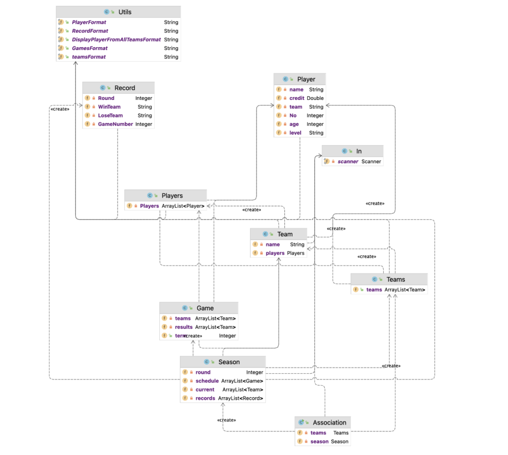
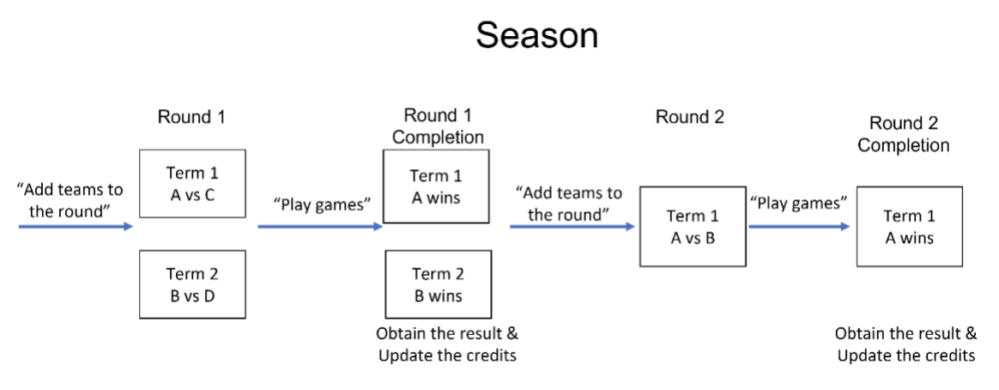

# UTS OOP Assignment: NBA Game System (HD Grade)

This project is a Command Line Interface (CLI) system that simulates NBA-style team and season management. By using OOP, I adhered to design specifications and met the strict I/O footprint, earning 35/35.

## System Design

The overall system comprises nine distinct components, as illustrated below:



These components include:
1. Association
2. Season
3. Teams
4. Team
5. Players
6. Player
7. Game
8. Record
9. Utils

## Season Logic

The game operates on a multi-round structure, where teams progress automatically based on game outcomes. The diagram below outlines the flow of the season logic:



## Key Features

The system incorporates several essential features:
- **Team & Player Management**: Add, update, and remove teams or players seamlessly.
- **Season Scheduling**: Automatically organize teams into rounds, simulate games, and display results.
- **Game Simulation**: Simulate games by determining winners based on player statistics and updating team credits accordingly.

## Summary of Applied Concepts

- **Object-Oriented Design**: This project leverages core OOP principles, including encapsulation, inheritance, and polymorphism.
- **Command-Line Interface (CLI)**: The system is structured as a CLI-based application, replicating NBA operations for a user-friendly experience.
- **Design Efficiency**: Streamlined game logic for efficient team management and season progression.

## How to run 

Run the main file:
    ```bash
    python3 app/Association.py
    ```
